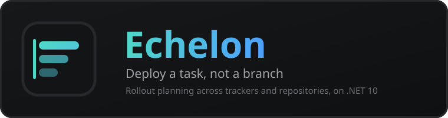

<p align="center">
  <a href="docs/README.md">
    
  </a>
</p>

# Echelon - Release Planning and Rollout

<p align="center"><b>English</b> - <a href="README.ru.md">Русский</a></p>

[](https://github.com/jrfrigat/echelon/actions/workflows/ci.yml)
[](https://dotnet.microsoft.com/)
[](LICENSE)

Echelon plans and runs releases around the unit people actually work in: the **task**. It reads tasks from an issue tracker and merge requests from one or more VCS connections, works out everything a task waits on - subtasks, linked tasks, repository ordering rules - orders the work into **deploy waves**, and drives the rollout into each environment. A task is rarely one repository, and Echelon answers the question a release engineer asks every day: what has to ship, in what order, and what is not ready yet.

**Task-centric planning - YAML ordering rules with a visual editor - per-environment rollouts and readiness - GitLab and Yandex Tracker adapters - SQL Server or PostgreSQL - Blazor admin PWA**

> **Not production-proven.** The code is covered and both database providers are verified against live servers, but no rollout has yet been executed against a real GitLab. See [Maturity](#maturity) before you rely on it.

---

## Features

- **Planning around a task, not a branch** - the target task's dependency closure (subtasks, linked tasks, repository ordering) is resolved into ordered deploy waves, so a change spanning five repositories ships as one thing
- **A plan is a projection, never a stored opinion** - every ingestion event rebuilds it from the atlas, and operator decisions survive as deltas replayed on each build, not as a frozen result the next webhook overwrites
- **One derivation** - recalculation, a hand edit, an imported YAML document and the launch itself reach the deploy order through the same code, and the plan records the order it decided
- **Never a silent plan** - a rollout may deploy against a declared constraint, but every broken constraint is recorded on the plan; it can never look clean while breaking one
- **A YAML ordering language** - groups and `needs` generalise "repository A after repository B" across tasks, connectors and repositories, with a visual editor that renders into the same document the planner reads
- **Plan import and validation** - export a plan, edit the waves, post it back; `validate` runs the same reconciliation as `import` and stores nothing
- **Membership overrides** - force a merge request into or out of a rollout, stored against the task so the decision survives the next ingestion event
- **Per-environment execution** - one claim per (merge request, environment), pluggable deploy strategies (merge, pipeline trigger, or your own), and an environment progression gate
- **Readiness rules** - per environment, overridable per repository, with a per-merge-request pin as the escape hatch when a signal cannot be observed
- **Two databases, one model** - SQL Server and PostgreSQL, with the provider divergences (concurrency token, filtered index dialect, collation) isolated in one file
- **Compile-time provider registration** - keyed services, no runtime assembly scanning; a breaking change to a port is a compile error in every adapter
- **Retention that lets the archive drain** - rollout and plan history age out, so a task that was ever deployed can finally leave the operational database
- **Blazor admin PWA** - served from the same origin as the API, localized in English and Russian

## Quick Start

Requires .NET 10 SDK and Docker.

```bash
git clone https://github.com/jrfrigat/echelon.git
cd echelon
cp .env.example .env      # set the passwords it names
docker compose up -d
# -> http://localhost:8081
```

PostgreSQL instead of SQL Server, and a single instance without Redis:

```bash
docker compose -f docker-compose.yml -f docker-compose.postgres.yml -f docker-compose.single-instance.yml up -d
```

Building and running from source:

```bash
dotnet build Echelon.slnx    # 0 errors, 0 warnings; warnings are errors
dotnet test Echelon.slnx
dotnet run --project src/Echelon.Web
```

> Migrations are applied at startup by default. For more than one replica turn that off
> (`Database__MigrateOnStartup=false`) and apply them from CI or an init container, or the replicas
> race each other.

## How a rollout is built

```
tracker + VCS  ->  atlas  ->  closure  ->  waves  ->  rollout per environment
   ingestion       tasks,     what the     ordered    one claim per
   (webhook         MRs,      target       deploy     (merge request,
    or poll)      branches    waits on     stages      environment)
```

The ordering comes from three sources merged into one graph: task links and hierarchy, the repository
ordering rules, and the operator's own edges. Cycles are broken by dropping the least critical edge,
and every drop is recorded as a conflict on the plan.

## Architecture

Onion, with dependencies pointing inwards only:

```
Core                    enums, pure parsing; no dependencies at all
  <- Application        ports, message contracts, the planning algorithm (no EF)
      <- Infrastructure EF models, DbContext, adapters (Rebus, Redis, DataProtection)
      <- Providers.Abstractions <- Providers.GitLab / Providers.YandexTracker
          <- Web (composition root, API, hosted PWA) / Ingress.Webhooks
```

The planning algorithm is pure and unit-tested without a database. Two hosts ship as separate images:
the application (API plus admin PWA) and the webhook ingress, which can be exposed on its own so the
API need not be.

> Three library packages are published for provider authors - `Echelon.Core`,
> `Echelon.Providers.Abstractions` and `Echelon.Application`. The hosts, the PWA and the migration
> assemblies ship as container images, not as a dependency anyone should take.

## Documentation

| Doc | Description |
| :-- | :-- |
| [User guide](docs/en/user-guide.md) | What each part is for and how to use it |
| [Getting started](docs/en/getting-started.md) | Local setup with Docker Compose |
| [Architecture](docs/en/architecture.md) | System design and data flow |
| [Configuration](docs/en/configuration.md) | Every setting and environment variable |
| [Providers](docs/en/providers.md) | Adding a VCS or tracker provider |
| [Operations](docs/en/operations.md) | Deployment, monitoring, archiving |
| [Localization](docs/en/localization.md) | How i18n works |

Russian versions live in [docs/ru](docs/ru); the index is [docs/README.md](docs/README.md). Design
notes that are still open are in [docs/issues](docs/issues/README.md).

## Maturity

Verified:

- 669 tests, 0 warnings, warnings-as-errors in CI
- migrations applied from empty on live SQL Server 2022 and PostgreSQL 16, including rollback cycles
- the application starts, migrates and reports healthy against both
- the HTTP API is covered against the real host: routes, authorization policies, status codes, bodies

Not verified:

- **no rollout has been executed against a real GitLab** - no deploy strategy has ever run for real
- container images are not built in the development environment (the registry is filtered)
- behaviour under load and with several replicas is reasoned about, not measured

## Contributing and security

See [CONTRIBUTING.md](CONTRIBUTING.md) and [SECURITY.md](SECURITY.md).

## License

MIT - see [LICENSE](LICENSE).
